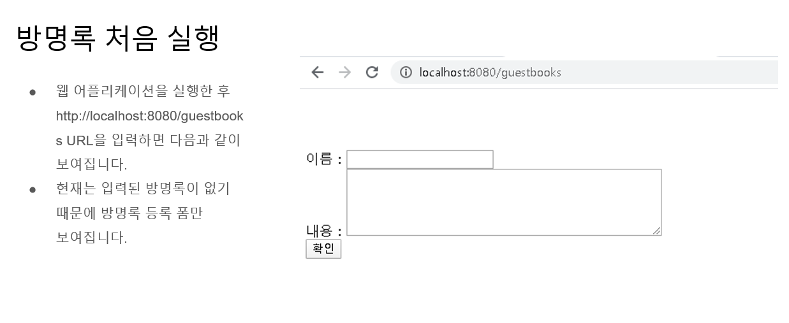
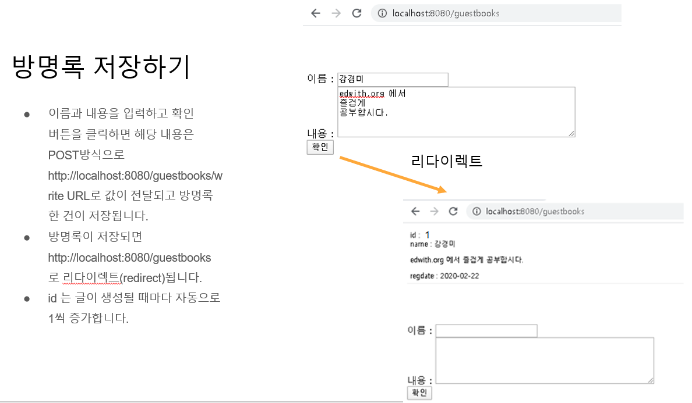

# Naver_BoostCourse_Backend_Project_B
네이버 부스트코스 백엔드 과정 프로젝트 B 방명록 만들기 프로젝트

## 기능 요구사항

[자세한 풀이 및 과정 링크](https://velog.io/@injoon2019/%EB%B6%80%EC%8A%A4%ED%8A%B8%EC%BD%94%EC%8A%A4-%EC%9B%B9-%ED%94%84%EB%A1%9C%EC%A0%9D%ED%8A%B8-B.-%EB%B0%A9%EB%AA%85%EB%A1%9D-%EB%A7%8C%EB%93%A4%EA%B8%B0)
